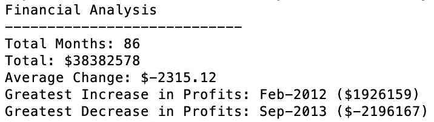
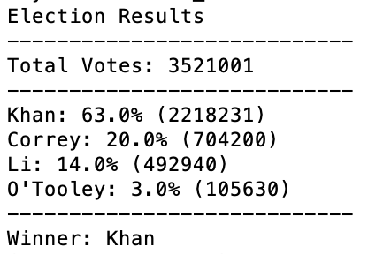

### Problem this analysis is trying to solve:
* The problem that the first analysis (PyBank) is trying to solve is condensing 86 months worth of finacial data into a summary of the net total amount of money, average change per month, greatest increase in a month, and greatest decrease in a month.
* The problem that the second analysis (PyPoll) is trying to solve is taking all the of votes for a particular election, adding them up, and determining which candidate is the winner based on the percent of votes each candidate received.

### How to run the code:
1. Save the PyBank and PyPoll folders to your computer.
1. Open up your terminal.
1. cd into the PyBank folder.
1. In your terminal, run the command "python main.py"
1. cd out of the PyBank folder and into the PyPoll folder.
1. In your terminal, run the command "python main.py"
1. In your terminal, you will be able to see the results. Also, an output csv file will be added to both the PyBank and PyPoll folders with the same results.

### Data Collected:

### Why the data is displayed this way:
The data is displayed in both the terminal and in an output csv file because the terminal is a quick way to view the results, while the csv file is a great way to save the results to your computer so that they will always be readily available. 
